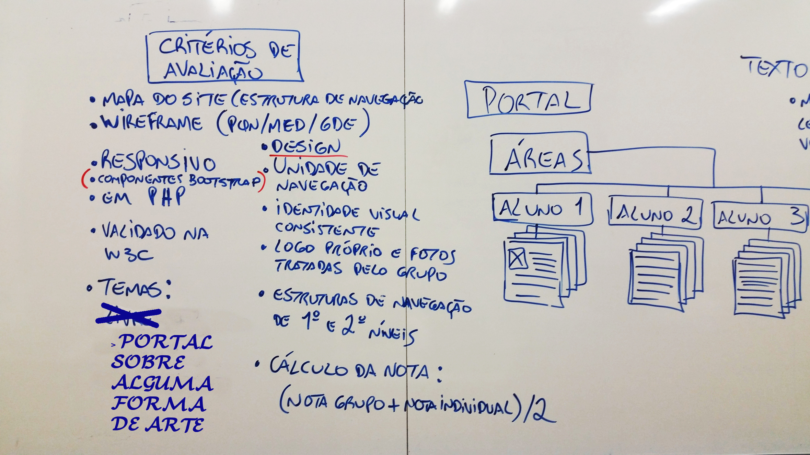
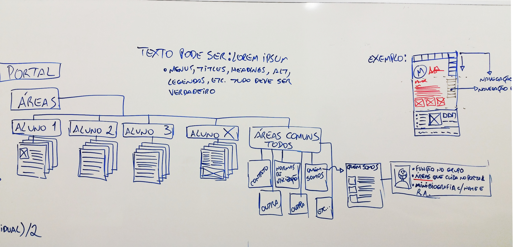

# Projeto Integrador - 2 Semestre
TEMA  - LITERATURA BRASILEIRA - ESCOLAS LITERARIA 

GRUPO [ Bruna – Cleisson – Filipe - Luiza - Priscila – Roberto ]

## Páginas

* [Site Hospedado (WebHost)](https://brasil-literario.000webhostapp.com/)
* [Diretório do Site](site)
* [Links de Validação](documentation/VALIDACAO.md)

#### Produção
* [AGENDA!](documentation/AGENDA.md)
* [Wireframes](producao/wireframe)
* [Mockups](producao/mockup)

#### Extras
* [Como editar arquivos ".md"](documentation/DICAS.md)
* [Informações de cada "Escola"](documentation/INFOS.md)

## Informações para a Equipe

> OBS: a tabela com Escolas, Características e Autores e Obras está no documento enviado por email

Escolas                                          | Responsável
------------------------------------------------ | -----------
Romantismo (1836 - 1881)                         | (Roberto)
Realismo Naturalismo Parnasianismo (1881 - 1893) | (Luiza)
Simbolismo (1893 - 1910)                         | (Cleisson)
Pré-Modernismo (1910 - 1922)                     | (Bruna)
Modernismo (1922 - 1950)                         | (Priscila)
Pós-Modernismo (1950 - até hoje)                 | (Filipe)

## Principais critérios de avaliação

* Concepção Mobile First;
* Existência de um Mapa do Site e Wireframe contemplando pelo menos 3 resoluções (pqn, med, gde);
* Ser responsivo (possivelmente com Bootstrap);
* Páginas validadas na W3.org;
* Design;
* Unidade de navegação;
* Estruturas de navegação de 1º e 2º níveis.

--------
## Observações adicionais:

- [x] O "tema" do portal será alguma forma de arte a ser definida livremente pelo grupo;
- [x] Cada aluno será responsável por uma "área" dentro do portal;
- [ ] O cálculo da nota será feito com a média entre a nota individual do aluno e a nota geral do grupo;
- [x] A áreas &quot;comuns&quot; são responsabilidade de todos os membros do projeto;
- [x] Recomendamos que o grupo eleja um gerente para coordenar as atividades de todos;
- [x] Recomendamos o uso da plataforma GIT;
- [x] Os textos podem ser &quot;lorem ipsum...&quot;, mas os menus, headings, alts, legendas e etc, devem todos ser textos verdadeiros. (Opcionalmente o texto pode ser real também, mas neste caso deve obrigatoriamente ser de domínio público e conter um link para a fonte original sempre que não for produção original do grupo);
- [x] São obrigatórias as páginas:
  - [x] Home;
  - [x] Quem Somos;
  - [x] Contato;
  - [x] Normas de Utilização
  - [x] Mais 4 páginas gerais definidas pelo grupo.
    - [x] Dicas de Vestibular
    - [x] Mapa do Site
    - [x] Academia Brasileira de Letras
    - [x] Agenda
- [x] A página "quem somos" é obrigatória e deve conter:
  - [x] Foto do aluno;
  - [ ] *Mini-biografia (144 caracteres);*
  - [x] Nome;
  - [ ] *R.A.;*
  - [x] Função no grupo (coder, gerente, designer, etc);
  - [x] Área pela qual é responsável, com link para a mesma.
  
--------
## Fotos Adicionais:
> Essa página pode ser visualizada através do endereço projectzr.github.io. 
> Caso esteja acessando por ela, você pode acessar o repositório [clicando aqui](https://github.com/projectzr/projectzr.github.io).

